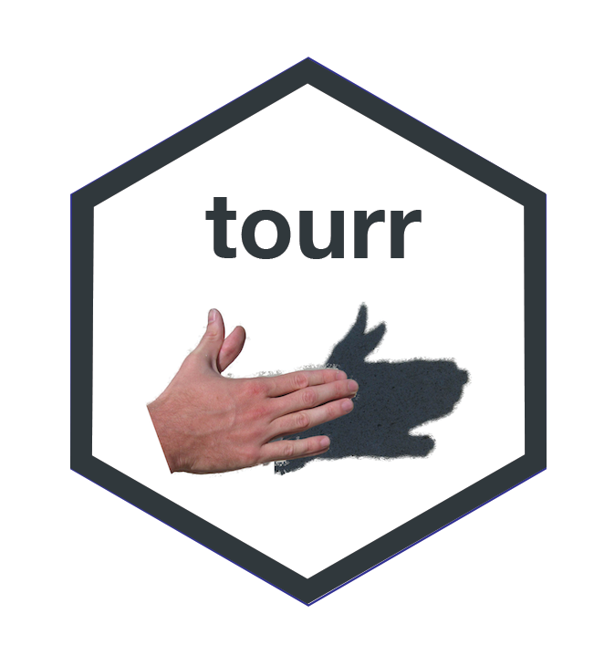

tourr: tour methods for multivariate data visualisation
================
Hadley Wickham, Di Cook
March 06, 2019

<!-- README.md is generated from README.Rmd. Please edit that file -->

# tourr 

The goal of tourr is to explore shapes of high-dimensional data. This
code also allows new tour methods to be created that utilise geodesic
interpolation and basis generation functions.

## Installation

You can install the released version of tourr from
[CRAN](https://CRAN.R-project.org) with:

``` r
install.packages("tourr")
```

You can install the development version of tourr from github with:

``` r
# install.packages("devtools")
devtools::install_github("ggobi/tourr")
```

## Example

To display the tour, when using the RStudio IDE, you may need to use a
different graphics device. On a Mac, I run `quartz()` before starting a
tour. On Windows, `X11()` may be the best.

``` r
if(Sys.getenv("RSTUDIO") == "1" & # check if running in RStudio
       .Platform$OS.type == "unix") quartz() else X11()
library(tourr)
animate_xy(flea[, 1:6])
```
