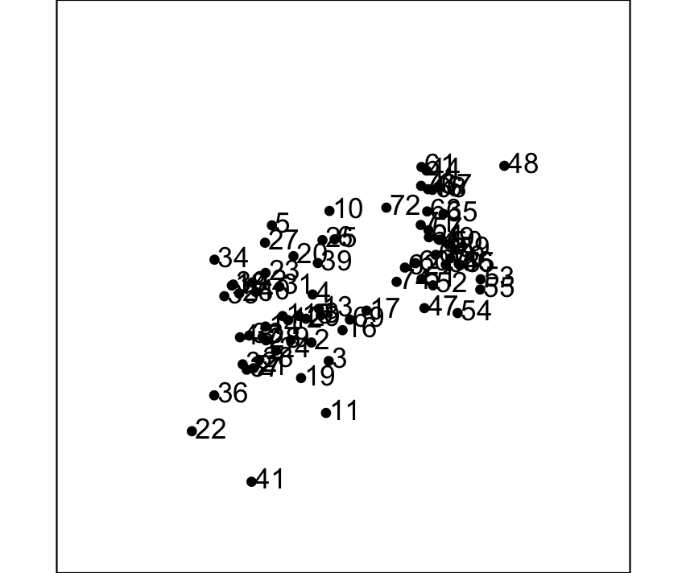
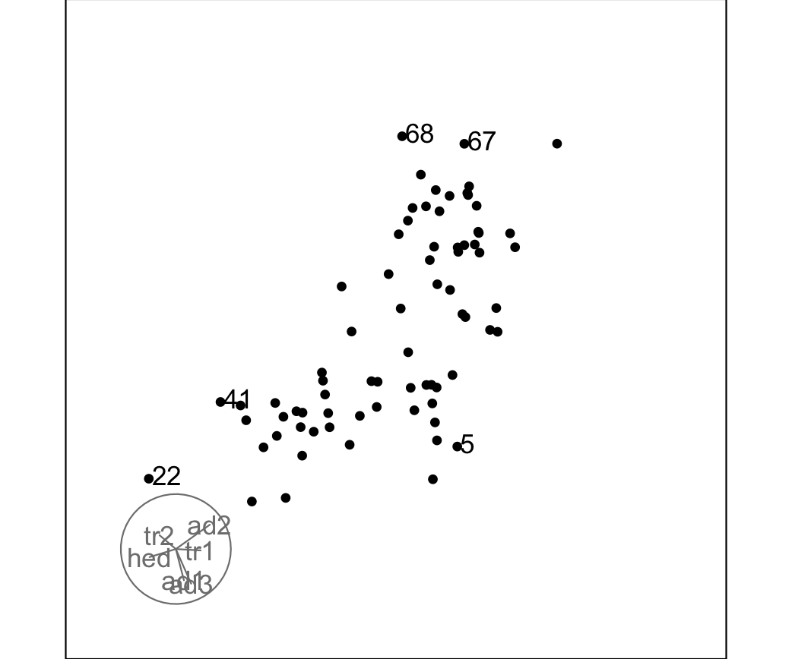
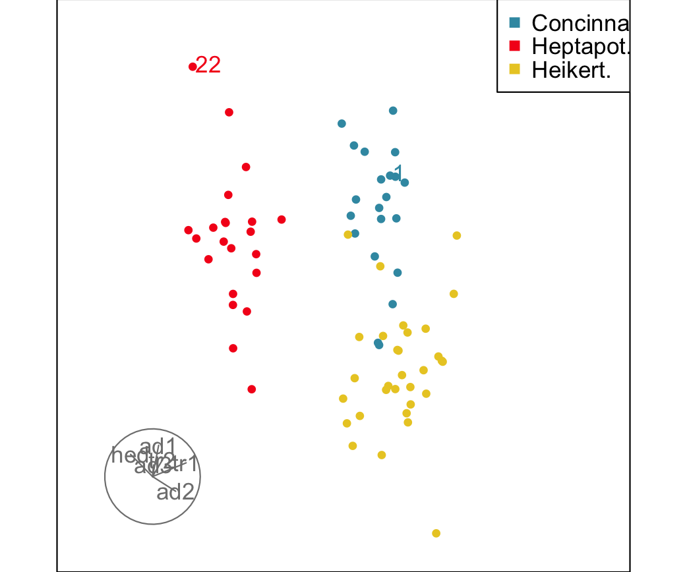

```{r setup, include = FALSE}
knitr::opts_chunk$set(
  collapse = TRUE,
  comment = "#>",
  eval = TRUE
)
library(tourr)
```

Labels can be added to individual observations in `animate_xy` via the
`obs_labels` argument of `display_xy`. This is useful when you want to track
specific points — outliers, known cases of interest, or a named subset — as
they move through the tour.

## Basic usage

Pass a character vector of the same length as the number of rows in your data.
Each element is the label that will be drawn next to the corresponding point.
Turning axes off keeps the plot uncluttered when labels are present.

```{r basic, eval = FALSE}
animate_xy(flea[,1:6],
  obs_labels = as.character(1:nrow(flea)),
  axes = "off"
)
```

Row numbers make a reasonable default label because they let you trace a point
back to a specific row of your data frame.

{width=400 fig-alt="Scatterplot with 74 points, and each one is numbered. Mostly numbers are unreaddable, except for a few on the outside of the cloud like 41 at the bottom."}

## Labelling a subset of observations

Labelling every point can become hard to read in larger datasets. To label
only a subset, supply an empty string `""` for the observations you want
to leave unlabelled. Only the non-empty strings are drawn.

Here we label just the five most extreme outliers, identified in advance
by their Mahalanobis distance:

```{r subset, eval = FALSE}
# Find the five points furthest from the multivariate centre
d2    <- mahalanobis(flea[,1:6], colMeans(flea[,1:6]), cov(flea[,1:6]))
top5  <- order(d2, decreasing = TRUE)[1:5]

# Build a label vector: empty for most points, row number for the top 5
lbls <- rep("", nrow(flea))
lbls[top5] <- as.character(top5)

animate_xy(flea[,1:6], obs_labels = lbls, axes="bottomleft")
```

{width=400 fig-alt="Scatterplot with 74 points. Five outlying points are labelled: 5, 22, 41, 67, 68."}

## Combining labels with colour

Labels and the `col` argument work independently, so you can colour by group
while still labelling individual points. A common workflow is to colour all
observations by a grouping variable and then label only the few points you
want to call out by name.

```{r colour, eval = FALSE}
# Colour by species; label only row 1 and row 22 (arbitrary examples)
lbls <- rep("", nrow(flea))
lbls[c(1, 22)] <- rownames(flea)[c(1, 22)]

animate_xy(flea[,1:6],
  col       = flea$species,
  obs_labels = lbls,
  axes      = "bottomleft"
)
```

{width=400 fig-alt="Scatterplot with 74 points coloured as blue, red, yellow matching the three species Concinna, Heptapot. and Heikert. Two points are labelled: 1 and 22."}

## Saving a labelled tour to a GIF

Interactive use is fine for exploration, but if you want to share a labelled
tour you can render it to a GIF with `render_gif`. The `frames` argument
controls how many frames are captured before the file is written; `width` and
`height` are in pixels.

```{r gif, eval = FALSE}
lbls <- rep("", nrow(f))
lbls[c(1, 22)] <- rownames(flea)[c(1, 22)]

render_gif(
  flea[,1:6],
  tour_path = grand_tour(),
  display   = display_xy(
    col        = flea$species,
    obs_labels = labs,
    axes       = "bottomleft"
  ),
  gif_file = "labelled_tour.gif",
  frames   = 60,
  width    = 400,
  height   = 400
)
```

## A note on label placement

Labels are drawn by the underlying call to `text()` in base graphics,
positioned directly at each point's projected coordinates. In dense regions
of a projection labels will overlap, which is expected — as the tour rotates,
points separate and the labels become readable in turn. If overlap is a
persistent problem, consider labelling a smaller subset or reducing `cex` via
the `...` passthrough:

```{r cex, eval = FALSE}
animate_xy(flea[,1:6],
  obs_labels = as.character(1:nrow(f)),
  axes = "off",
  cex  = 0.6
)
```
